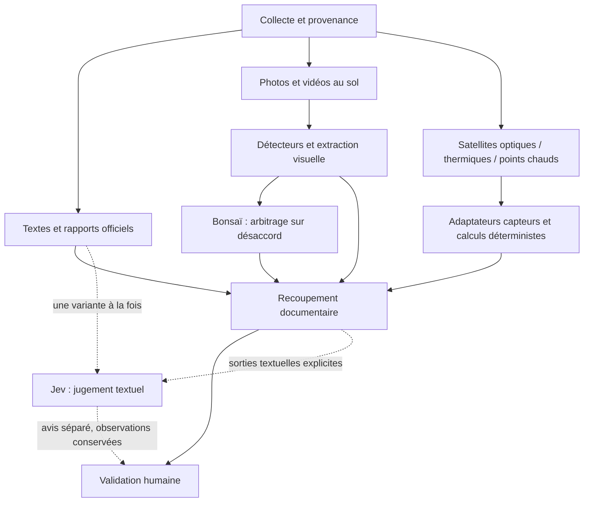

# Architecture

Séquence obligatoire : collecte → traitement visuel nécessaire → recoupement →
validation humaine. Un doute textuel ne supprime jamais une image ni un signalement.
Jev ne produit ni coordonnées, ni masques, ni calcul de progression, ni alerte autonome.
Le typage des réponses n'en garantit pas la vérité et ne rend pas le modèle déterministe.

`components.py` porte les contrats et les règles préalables ; `component_runner.py`
mesure chaque appel et conserve un avis séparé (`sidecar`). La liaison actuelle est
`export_adapter_only` : elle compare des reçus et ajoute un avis optionnel. Aucun
remplacement effectif d'un ancien classifieur sémantique n'a été démontré. Lorsqu'une
brique équivalente sera identifiée, son reçu devra être figé pour une comparaison appariée.

Bonsaï 2 est le juge multimodal du pipeline standard, distinct de Jev. Il examine
les preuves disponibles et choisit parmi les candidats existants ou s'abstient.
Le changement remplace le rôle `consensus_judge` ; la recherche de sources conserve
Qwen3-14B. Les mêmes modèles visuels et le même juge doivent servir toutes les variantes Jev.

Les images satellites de présentation ne sont pas des contributions utilisateur.
Les COG optiques passent dans le collecteur Sentinel-2 existant ; les observations
thermiques et points chauds gardent acquisition, capteur, emprise et FRP quand disponibles.
Une simulation ne devient jamais un périmètre observé.
